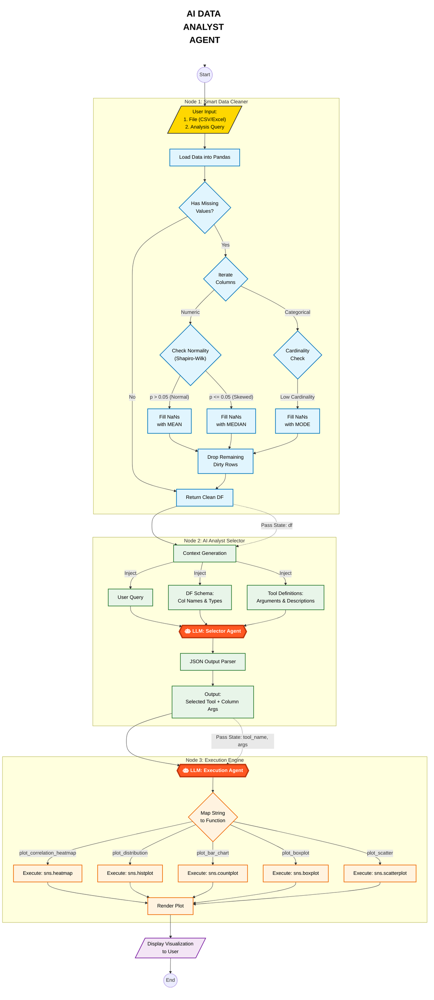

# 📊 AI Data Analyst Agent: Talk to Your Data

## 📌 Project Overview
**AI Data Analyst** is an intelligent conversational agent that acts as a virtual data scientist. It empowers users to interact with their datasets using natural language, automating the complex process of writing code for data analysis and visualization.

Orchestrated by **LangGraph**, the system utilizes a **Stateful Graph Architecture** to plan, execute, and self-correct data workflows. It leverages **Google Gemini 2.5** to reason about data schemas, generate accurate **Pandas** queries, and render **Seaborn/Matplotlib** charts instantly.

---

## 🎯 Objectives
- **Democratize Data Analysis:** Allow non-technical users to query complex datasets using plain English.
- **Automate Visualization:** Automatically select and generate the most appropriate charts (Bar, Line, Scatter, Heatmap) for the data.
- **Self-Correcting Code:** Use a cyclic graph to detect execution errors (e.g., syntax errors) and autonomously fix the code before showing the result.
- **Stateful Reasoning:** Maintain context across the analysis pipeline, understanding the difference between raw data ingestion and analytical output.

---

## 📁 Data & Workflow

This project is agnostic to the specific dataset but is optimized for structured tabular data (CSV, Excel).

### Analysis Pipeline
The agent follows a "Think -> Code -> Execute -> Observe" loop:
1.  **Ingest:** Load the DataFrame and extract schema (column names, types, sample values).
2.  **Plan:** The LLM breaks down the user's question into logical Pandas operations.
3.  **Generate:** Python code is generated dynamically.
4.  **Execute:** The code runs in a safe local environment.
5.  **Visualize:** If the user asks for a plot, the agent generates the Matplotlib code and renders the image.

---

## 🏗️ System Architecture

The project follows a **Cyclic State Graph** where the agent can loop back to correct itself if code execution fails.

## 🔑 Steps Followed
1.  **Environment Setup** – Configured `dotenv` for API keys and initialized the Google Gemini model.
2.  **DataFrame Loading** – Implemented Pandas logic to read tabular data and infer data types.
3.  **Agent Initialization** – Built a **LangGraph StateGraph** to manage the conversation history and current scratchpad (code drafts).
4.  **Prompt Engineering** – Designed a system prompt that forces the LLM to output only executable Python code, strictly adhering to the column names provided.
5.  **Execution Sandbox** – Created a `PythonREPL` tool node that runs the generated code and captures `stdout` or `stderr`.
6.  **Error Handling** – Implemented a feedback loop: if `stderr` is detected, it is fed back to the LLM as a new prompt ("You got this error, fix it.").

---

## 📊 Example Queries

**Descriptive Statistics:**
> *"What is the average age of customers in the dataset?"*
> *"Show me the summary statistics for the 'Revenue' column."*

**Complex Filtering:**
> *"Filter for sales in 'New York' where the profit margin is above 20%."*

**Visualization:**
> *"Plot a bar chart showing total sales by Product Category."*
> *"Generate a heatmap showing the correlation between all numerical columns."*

---

## 🛠️ Tech Stack

This project is built using the following technologies and frameworks:

* **Python**: The core programming language.
* **LangGraph**: For creating the cyclic, stateful agent workflow.
* **LangChain**: For prompt templates and tool bindings.
* **Google Gemini 2.5**: The high-performance LLM used for code generation.
* **Pandas**: For high-performance data manipulation and analysis.
* **Matplotlib / Seaborn**: For static data visualization.
* **Jupyter Notebook**: The interactive development environment.

---

## 👨‍💻 Author
**Sagar Sidhwa**
* **AI / ML Engineer**
* **Education:** MS in CS (AI Track) — Binghamton University
* *Focusing on ML and end-to-end real-world projects. Open to collaboration!*
