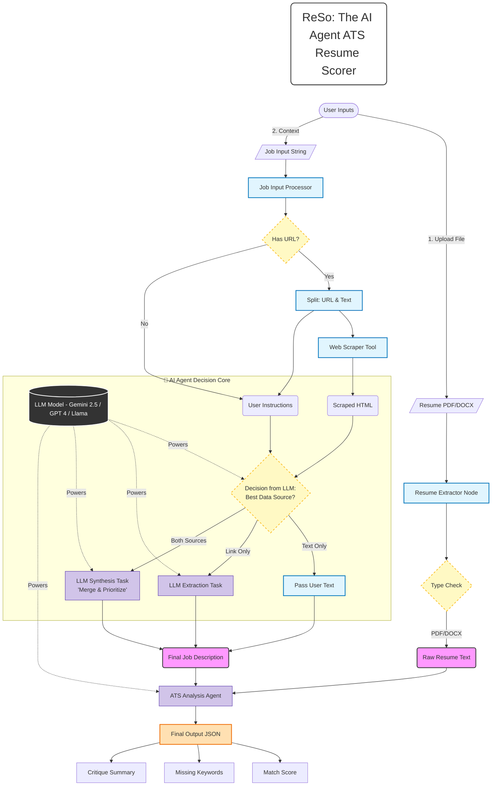

# 🚀 ReSo: The AI Agent ATS Resume Scorer

## 📌 Project Overview
**ReSo (Resume Solver)** is an advanced **AI Agent** designed to automate the optimization of resumes for Applicant Tracking Systems (ATS).

It implements a **State-Based Graph Architecture** using **LangGraph** to autonomously handle complex workflows:
1.  **Intelligent Ingestion:** Parses resumes (PDF/DOCX) and processes Job Descriptions from raw text or live URLs.
2.  **Hybrid Scraping Engine:** A smart crawler that attempts fast static scraping first, then auto-switches to a **headless browser (Playwright)** for dynamic JavaScript-heavy sites.
3.  **Context Synthesis:** Uses **Google Gemini 2.5** to merge user instructions with scraped web content to create the perfect "Target Context."

The system acts as a strict **AI Recruiter**, providing a match score (0-100), identifying missing keywords, and offering strategic critique.

---

## 🎯 Objectives
- Build a **Stateful AI Agent** using LangGraph to orchestrate multi-step reasoning.
- **Hybrid Scraping:** Implement a fallback mechanism (Requests $\to$ Playwright) to handle any Job Description URL.
- **Context Awareness:** Merge user-provided notes (e.g., "Focus on my Python skills") with full web-scraped job details.
- **ATS Simulation:** Use LLM reasoning to strictly evaluate resumes against JDs, mimicking corporate screening algorithms.
- **Automation:** Eliminate manual copy-pasting by fetching job details directly from the source.

---

## 📁 Input Processing & Scraping Logic

This project does not rely on static datasets; instead, it processes live data through a robust pipeline.

### Document Parsing
* **PDFs:** Processed using `PyMuPDF (fitz)` to extract clean text while preserving layout logic.
* **Word Docs:** Processed using `python-docx`.

### Intelligent Scraper (The "Crawler" Node)
The agent uses a smart decision tree for fetching Job Descriptions:
1.  **Input Detection:** Regex identifies if the user provided text or a URL.
2.  **Path A (Static):** Tries `Requests` + `BeautifulSoup`. Fast, lightweight.
3.  **Path B (Dynamic):** If Path A fails (or content is sparse), it spins up `Playwright` (Headless Chromium) to render the page and extract text.

---

## 🏗️ System Architecture

The project follows a Directed Cyclic Graph (DAG) workflow managed by **LangGraph**.

## 🔑 Steps Followed
1.  **Environment Setup** – Configured `dotenv` for secure Google API Key management.
2.  **Graph State Definition** – Created a `TypedDict` to maintain state (`resume_text`, `scraped_content`, `analysis_reports`) across nodes.
3.  **Node Engineering**:
    * **Extractor Node:** Handles file I/O for PDFs and DOCX.
    * **Input Processor:** Splits user text from URLs using Regex.
    * **JD Merger:** Uses LLM to decide if the user's manual notes override or augment the scraped text.
4.  **LLM Integration** – Utilized `gemini-2.5-flash-lite` for high-speed, low-cost reasoning.
5.  **Output Parsing** – Enforced JSON structured output for clean integration into DataFrames/UI.

---

## 📊 Workflow Scenarios

**Scenario 1: Simple Text**
> **Input:** `resume.pdf` + "Looking for a Python Dev role with SQL skills."
> **Action:** Agent uses raw text as the JD.

**Scenario 2: Direct URL**
> **Input:** `resume.pdf` + "https://linkedin.com/jobs/view/..."
> **Action:** Agent scrapes the link, extracts the core JD, and ignores sidebars/ads.

**Scenario 3: URL + Context**
> **Input:** `resume.pdf` + "https://company.com/job/123 - Ignore the Java requirement, I want to focus on the Cloud aspects."
> **Action:** Agent scrapes the URL but strictly follows the user's instruction to downweight Java in the final scoring.

---

## 🛠️ Tech Stack

This project is built using the following technologies and frameworks:

* **Python**: Core programming language.
* **LangGraph**: For building stateful, multi-actor applications with LLMs.
* **LangChain**: Framework for LLM interface and prompting.
* **Google Gemini 2.5**: The primary LLM used for reasoning and text synthesis.
* **Playwright**: For dynamic web scraping (handling JavaScript execution).
* **BeautifulSoup4**: For static HTML parsing and cleaning.
* **PyMuPDF (Fitz)**: High-performance PDF text extraction.
* **Pandas**: For structuring the final analysis report into a readable format.

---

## 👨‍💻 Author
**Sagar Sidhwa**
* **AI / ML Engineer**
* **Education:** MS in CS (AI Track) — Binghamton University
* *Focusing on ML and end-to-end real-world projects. Open to collaboration!*
